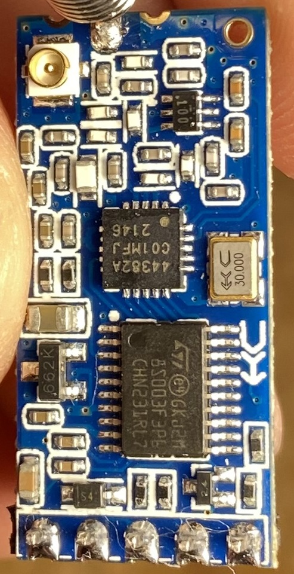

# HC-12 Si4438 433MHz Module

The HC-12 has a great range for 433MHz but the downside is that the module can only communicate with another HC-12. Also the price for these modules are very similar to ESP8266 and LoRa devices at least here in South Africa.

Unless you need a really long range I would choose WiFi simply because of the scaleability and compatibility with multiple WiFi devices. For other 433MHz solutions, LoRa modules are cheaper and way more common with pretty much the same if not better long range functionality.

That being said these HC-12 modules are very easy to use as data is sent via serial. Zero libraries are needed and almost any MCU can communicate via serial these days. Still this feature also acts as a double edged sword since customizability is very limited.

So overall there's a few tradeoffs but for one time solutions or for learning purposes it's a great module.

Links
- [Si4438 Chip](https://www.silabs.com/wireless/proprietary/ezradiopro-sub-ghz-ics/device.si4438)
- [Original board](https://make.net.za/product/hc12-si4438-433mhz-module/)
- [Fake board](https://botshop.co.za/products/hc-12-si4463-wireless-serial-module-433-mhz-1000m)
- [Fake board distance fix](https://www.instructables.com/HC-12-Distance-Problems/)
